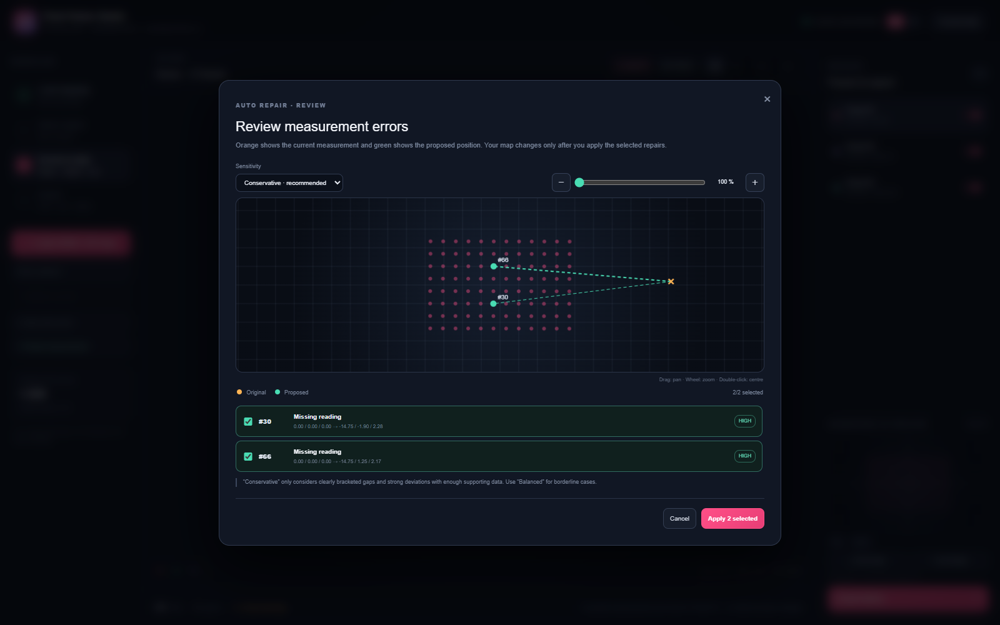

# Pixel Fixture Studio

> Turn irregular Pixelblaze and Marimapper LED scans into clean, aligned MadMapper fixtures — entirely in your browser.

[](https://pixel-fixture-studio.jimmyblunt44.chatgpt.site/)
[](https://github.com/JimmyBlunt/pixel-fixture-studio/actions/workflows/ci.yml)
[](LICENSE)


Pixel Fixture Studio is a local-first visual workflow for scanned, irregular LED installations. Load a Pixelblaze JSON map or a Marimapper CSV, inspect the reconstructed installation in 3D, isolate physical panels, repair suspicious measurements, align each panel in 2D, and export MadMapper-ready fixture files.

The hosted app currently uses access-controlled Sites hosting. Everyone can run the public source locally with the instructions below.

## Highlights

- Pixelblaze JSON and Marimapper 2D/3D CSV import
- Interactive 3D orbit, zoom, orthographic views, optional pixel numbers, click and box selection
- Pixel editor with coordinate entry, multi-pixel keyboard nudging, search, and insertion
- Automatic spatial panel detection with per-panel enable/disable controls
- Large 2D alignment workspace with free rotation, axis snap, scaling, and horizontal/vertical flip
- Automatic placement and export of missing Marimapper indices or blank coordinate rows
- Matrix- and zigzag-aware repair with measured coordinates protected by default
- Optional transparent MMFL cell grid in every 2D preview, including empty output cells
- MadMapper 6.1 SVG, CSV, and experimental MMFL exports
- English default interface with instant German translation
- Local-first processing: map files never leave the browser

## Workflow

### 1. Load and inspect

Open the [hosted app](https://pixel-fixture-studio.jimmyblunt44.chatgpt.site/) (workspace access may be required) or run it locally, then load a mapping file. The included demo shows three separated panels, so every tool can be explored without supplying data.

### 2. Select and align

Choose a detected panel or draw a box around LEDs to create a custom panel. Click a pixel to inspect and edit its X/Y/Z values, search by its one-based pixel number, or enable Edit Mode to move a selection with the arrow keys. `Page Up`/`Page Down` move Z and `Shift` uses a 10× step. New pixels can be inserted into the active panel; following source numbers shift forward.

Swap the large workspace to 2D to rotate, snap, scale, or flip the fixture before export. Enable the MMFL grid to see the exact quantised cells, including empty cells, that the MMFL export will contain.


### 3. Review repairs

Missing Marimapper indices and rows with empty coordinates are positioned immediately during CSV import. The algorithm learns the panel-wide average pitch, row length, and raster or zigzag direction, then combines that model with up to four measured neighbours before and after each missing pixel. Automatically inferred pixels are marked in turquoise, included in the active panel and export, and never used to train the model themselves.

Auto Repair protects measured coordinates by default. Scanned outlier review must be enabled explicitly and uses a conservative `2.5 ×` spacing threshold; proposed changes still require individual confirmation.



### 4. Export

Set the exact MadMapper fixture definition, universe, start channel, channel count, and pixel size. The download name is derived from the **Fixture Definition** field and previewed before export.


## Supported input formats

Pixelblaze JSON accepts an array of coordinate arrays or objects:

```json
[
  [0.0, 1.2, 2.4],
  [1.0, 1.2, 2.3]
]
```

Object roots named `coordinates`, `points`, `map`, or `pixelMap` are also supported. Rows may use `{ "x": 0, "y": 1.2, "z": 2.4 }`.

Marimapper CSV accepts:

```csv
index,x,y,z,xn,yn,zn,error
0,12.3,18.4,4.1,0.12,0.18,0.04,0.01
```

or the 2D form:

```csv
index,u,v
0,0.12,0.18
```

Sparse Marimapper indices and indexed rows with blank/non-finite coordinates are preserved. Whenever enough measured neighbours exist, their likely positions are calculated automatically without changing the pixel numbering.

## MadMapper export formats

| Format | Best for | Notes |
| --- | --- | --- |
| SVG 6.1 | Freeform fixture placement | Preserves precise 2D positions, panel groups, and DMX attributes. |
| CSV | Fixture instance tables | Semicolon-delimited rows with definition, patch, bounds, and group path. |
| MMFL | Fixture Editor experiments | Quantises each panel onto a 2D grid. The imported product name comes from **Fixture Definition**; multi-panel exports append the panel name. |

MadMapper fixtures are 2D. Each selected 3D panel is projected onto its own best-fit plane; the source map and LED order remain unchanged.

## Run locally

Requirements: Node.js 22.13+ and pnpm.

```bash
git clone https://github.com/JimmyBlunt/pixel-fixture-studio.git
cd pixel-fixture-studio
pnpm install
pnpm dev
```

Open `http://localhost:3000`. Production checks:

```bash
pnpm lint
pnpm build
```

## Project structure

```text
app/page.tsx        parsing, spatial analysis, interaction, and export generation
app/globals.css     responsive workspace and modal styling
app/layout.tsx      site metadata and social preview
docs/               architecture notes and screenshots
.github/            CI, issue forms, and pull request template
```

See [Architecture](docs/ARCHITECTURE.md) for the data flow and design constraints.

## Contributing

Bug reports, format samples, and focused pull requests are welcome. Start with [CONTRIBUTING.md](CONTRIBUTING.md), which includes setup, privacy guidance for mapping samples, and the review checklist.

## License and project status

Released under the [MIT License](LICENSE). Pixel Fixture Studio is an independent community project and is not affiliated with Pixelblaze, Marimapper, or MadMapper. MMFL is intentionally marked experimental because its internal format is not fully documented publicly.
