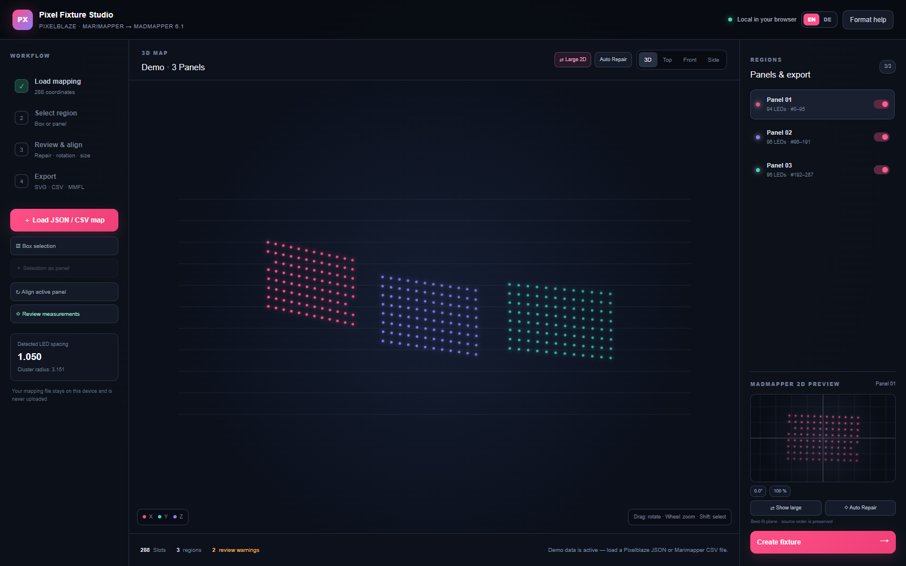
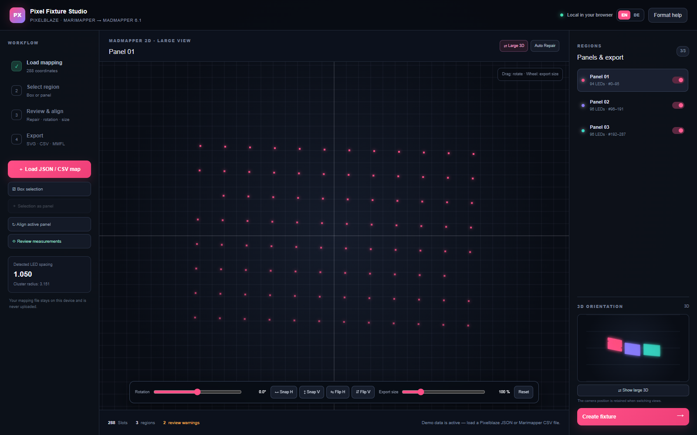
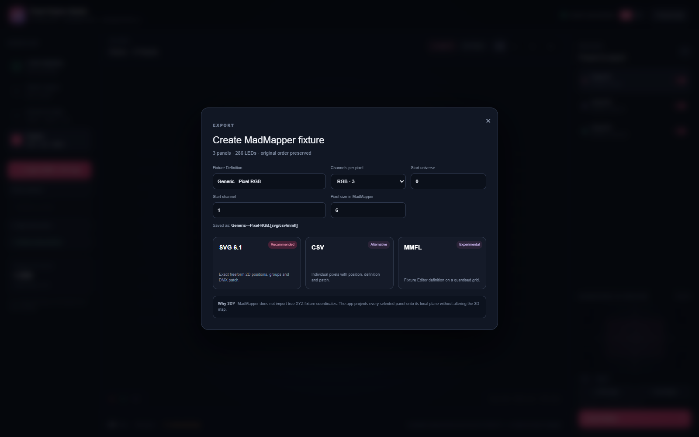

# Pixel Fixture Studio

> Turn irregular Pixelblaze and Marimapper LED scans into clean, aligned MadMapper fixtures — entirely in your browser.

[](https://pixel-fixture-studio.jimmyblunt44.chatgpt.site/)
[](https://github.com/JimmyBlunt/pixel-fixture-studio/actions/workflows/ci.yml)
[](LICENSE)



Pixel Fixture Studio is a local-first visual workflow for scanned, irregular LED installations. Load a Pixelblaze JSON map or a Marimapper CSV, inspect the reconstructed installation in 3D, assemble the physical installation from arbitrary matrix, strip, and single-pixel modules, and export MadMapper-ready fixture files.

The hosted app currently uses access-controlled Sites hosting. Everyone can run the public source locally with the instructions below.

## Highlights

- Pixelblaze JSON and Marimapper 2D/3D CSV import
- Interactive 3D orbit, zoom, orthographic views, optional pixel numbers, click and box selection
- Automatic spatial panel detection with per-panel enable/disable controls
- Automatic placement and export of missing Marimapper indices or blank coordinate rows
- Modular fixture builder for matrices of any dimensions, arbitrary strips, and individual LEDs
- Scan-assisted zigzag, row/column flow, and start-corner detection with manual overrides
- Immediate module draft after CSV import: repeated row returns become matrices, serpentine reversals determine likely row length, and unmatched runs remain strips
- Per-module X/Y placement, physical width/height, rotation, and an export-exact MMFL preview
- Individual or multi-pixel grid editing with arrow keys, number-range selection, and preview-before-apply collision checks
- Whole-fixture grid scaling to reduce empty spacing, separate from viewport zoom
- Scan-view layout transfer: suggested modules inherit their relative centre, projected orientation, and size from the retained 3D camera, with one-click re-alignment after rotating the scan
- Strict coverage rules: each imported LED slot is assigned once, and only modules that fit a remaining contiguous range can be added
- Reserved hidden LEDs remain part of the wiring order and DMX address spacing without rendering a visible MMFL cell
- MadMapper 6.1 SVG, CSV, and experimental MMFL exports
- English default interface with instant German translation
- Local-first processing: map files never leave the browser

## Workflow

### 1. Load and inspect

Open the [hosted app](https://pixel-fixture-studio.jimmyblunt44.chatgpt.site/) (workspace access may be required) or run it locally, then load a mapping file. The included demo shows three separated panels, so every tool can be explored without supplying data.

### 2. Allocate physical modules

Open the Module Builder and choose a matrix, strip, or single pixel. Matrix dimensions are unrestricted within the number of remaining contiguous LED slots: 3×4, 9×9, 8×32, 12×3, and mixed layouts are all valid. The builder shows every free source-index range and prevents assignments that overlap an existing module or exceed the confirmed scan length.

Start a module at the next free slot or at the first LED selected in the 3D scan. Wiring direction, row/column order, serpentine routing, and the start corner are estimated from the assigned scan range and remain manually editable.



### 3. Arrange the output grid

Drag complete modules in the large 2D builder, then enter exact X/Y positions, physical width and height, and rotation. The preview and MMFL exporter share the same rounded grid, so collisions are visible before export and block an invalid MMFL download.

Use **Edit pixels / compact grid** to adjust individual LEDs without moving their complete module. Click a pixel, use Ctrl/Command or Shift-click for multiple selection, or enter displayed pixel numbers such as `1-20, 35`. Arrow keys and the on-screen arrows move the selection by one output cell. Displayed numbers are one-based; the selected LED's original zero-based CSV index and channel offset are shown alongside them.

**Fixture grid scale** below 100% reduces spacing across the entire fixture and rounds the result onto the output grid. **View zoom** only magnifies the preview. Newly overlapping pixels appear in orange and can be selected using the collision buttons; resolve new overlaps before applying. **Cancel** discards the draft, while **Apply correction** updates the MMFL layout only. Original 3D coordinates and source/DMX addresses stay unchanged. Generating new module suggestions replaces these manual fixture corrections.

Pixels that exist physically but must never light can be marked hidden on their module. A hidden pixel stays visible as a crossed placeholder in the editor and continues to consume its source index and channel offset. The MMFL cell is written as `0`; every later mapped cell is still calculated from its original source index. This is the compatibility approach used because MMFL does not publicly document a dedicated hidden-pixel flag.

For every Marimapper CSV, the import dialog shows the detected source-index range, measured count, and the exact missing indices, then asks for the authoritative physical LED count. If a file starts above index 0, the user can preserve those leading source slots as missing LEDs; the app recommends this when the first observed matrix row is incomplete. Immediately after import, repeated row-return distances and serpentine direction reversals generate an editable module draft and open the complete MMFL preview.

### 4. Export

Set the exact MadMapper fixture definition, universe, start channel, channel count, and pixel size. The download name is derived from the **Fixture Definition** field and previewed before export.



## Supported input formats

Pixelblaze JSON accepts an array of coordinate arrays or objects:

```json
[
  [0.0, 1.2, 2.4],
  [1.0, 1.2, 2.3]
]
```

Object roots named `coordinates`, `points`, `map`, or `pixelMap` are also supported. Rows may use `{ "x": 0, "y": 1.2, "z": 2.4 }`.

Marimapper CSV accepts:

```csv
index,x,y,z,xn,yn,zn,error
0,12.3,18.4,4.1,0.12,0.18,0.04,0.01
```

or the 2D form:

```csv
index,u,v
0,0.12,0.18
```

Sparse Marimapper indices and indexed rows with blank/non-finite coordinates are preserved within the confirmed scan length. Whenever enough measured neighbours exist, their likely positions are calculated automatically without changing the order. A non-zero first CSV index becomes the first loaded slot, preventing phantom LEDs before the actual scan.

## MadMapper export formats

| Format | Best for | Notes |
| --- | --- | --- |
| SVG 6.1 | Freeform fixture placement | Preserves precise 2D positions, panel groups, and DMX attributes. |
| CSV | Fixture instance tables | Semicolon-delimited rows with definition, patch, bounds, and group path. |
| MMFL | Modular fixture grid | Combines all assigned modules into one exact grid. Hidden LEDs become empty cells while preserving the source/DMX offset. The imported product name comes from **Fixture Definition**. |

MadMapper fixtures are 2D. Each selected 3D panel is projected onto its own best-fit plane; the source map and LED order remain unchanged.

## Run locally

Requirements: Node.js 22.13+ and pnpm.

```bash
git clone https://github.com/JimmyBlunt/pixel-fixture-studio.git
cd pixel-fixture-studio
pnpm install
pnpm dev
```

Open `http://localhost:3000`. Production checks:

```bash
pnpm lint
pnpm build
```

## Project structure

```text
app/page.tsx        parsing, spatial analysis, interaction, and export generation
app/globals.css     responsive workspace and modal styling
app/layout.tsx      site metadata and social preview
docs/               architecture notes and screenshots
.github/            CI, issue forms, and pull request template
```

See [Architecture](docs/ARCHITECTURE.md) for the data flow and design constraints.

## Contributing

Bug reports, format samples, and focused pull requests are welcome. Start with [CONTRIBUTING.md](CONTRIBUTING.md), which includes setup, privacy guidance for mapping samples, and the review checklist.

## License and project status

Released under the [MIT License](LICENSE). Pixel Fixture Studio is an independent community project and is not affiliated with Pixelblaze, Marimapper, or MadMapper. MMFL is intentionally marked experimental because its internal format is not fully documented publicly.
